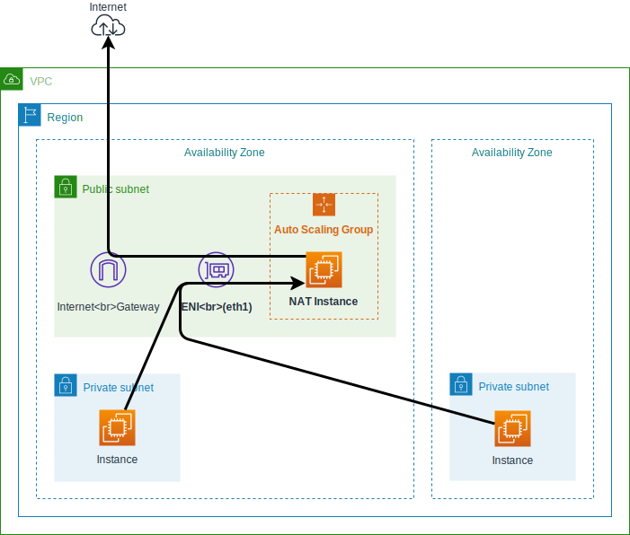

# terraform-aws-nat-instance [](https://circleci.com/gh/int128/terraform-aws-nat-instance)

This is a Terraform module which provisions a NAT instance.

Features:

- Providing NAT for one or more private subnets
- Auto healing by the Auto Scaling Group
- Saving cost by spot requests
- Fixed public IP address using an Elastic IP and Elastic Network Interface
- Login with Systems Manager Session Manager

Terraform 0.12 is required.


## Getting Started

You can use this module with [terraform-aws-modules/vpc/aws](https://registry.terraform.io/modules/terraform-aws-modules/vpc/aws) module as follows:

```tf
module "vpc" {
  source  = "terraform-aws-modules/vpc/aws"

  name                 = "main"
  cidr                 = "172.18.0.0/16"
  azs                  = ["us-west-2a", "us-west-2b", "us-west-2c"]
  private_subnets      = ["172.18.64.0/20", "172.18.80.0/20", "172.18.96.0/20"]
  public_subnets       = ["172.18.128.0/20", "172.18.144.0/20", "172.18.160.0/20"]
  enable_dns_hostnames = true
}

module "nat" {
  source = "int128/nat-instance/aws"

  name                        = "main"
  vpc_id                      = module.vpc.vpc_id
  public_subnet               = module.vpc.public_subnets[0]
  private_subnets_cidr_blocks = module.vpc.private_subnets_cidr_blocks
  private_route_table_ids     = module.vpc.private_route_table_ids
}
```


## How it works

This module provisions the following resources:

- Launch Template for the NAT instance
- Auto Scaling Group with mixed instances policy
- Elastic IP
- Elastic Network Interface
- Security Group for the NAT instance
- IAM Role for SSM and ENI attachment
- VPC Route (optional)

Take a look at the diagram:



By default an instance of the latest Amazon Linux 2 is launched.
The instance will run [init.sh](data/init.sh) to enable NAT as follows:

1. Attach the ENI to `eth1`.
1. Set the kernel parameters for IP forwarding and masquerade.
1. Switch the default route to `eth1`.


## Configuration

### Set extra IAM policies

You can attach an extra policy to the IAM role of the NAT instance. For example,

```tf
resource "aws_iam_role_policy" "nat_iam_ec2" {
  role = module.nat.iam_role_name
  policy = <<EOF
{
    "Version": "2012-10-17",
    "Statement": [
        {
            "Effect": "Allow",
            "Action": [
                "ec2:DescribeInstances"
            ],
            "Resource": "*"
        }
    ]
}
EOF
}
```

### Run a script

You can set an extra script to run in the NAT instance.
The current region is exported as `AWS_DEFAULT_REGION` and you can use awscli without a region option.

For example, you can expose port 8080 of the NAT instance using DNAT:

```tf
module "nat" {
  extra_user_data = templatefile("${path.module}/data/nat-port-forward.sh", {
    eni_private_ip = module.nat.eni_private_ip
  })
}
```

```sh
# Look up the target instance
tag_name="TARGET_TAG"
target_private_ip="$(aws ec2 describe-instances --filters "Name=tag:Name,Values=$tag_name" | jq -r .Reservations[0].Instances[0].PrivateIpAddress)"

# Expose the port of the NAT instance.
iptables -t nat -A PREROUTING -m tcp -p tcp --dst "${eni_private_ip}" --dport 8080 -j DNAT --to-destination "$target_private_ip:8080"
```


### Allow SSH access

For example,

```tf
module "nat" {
  key_name = "YOUR_KEY_PAIR"
}

resource "aws_security_group_rule" "nat_ssh" {
  security_group_id = module.nat.sg_id
  type              = "ingress"
  cidr_blocks       = ["0.0.0.0/0"]
  from_port         = 22
  to_port           = 22
  protocol          = "tcp"
}
```


## Contributions

This is an open source software. Feel free to open issues and pull requests.


<!--terraform-docs-->
## Inputs

| Name | Description | Type | Default | Required |
|------|-------------|:----:|:-----:|:-----:|
| extra\_user\_data | Extra script to run in the NAT instance | string | `""` | no |
| image\_id | AMI of the NAT instance. Default to the latest Amazon Linux 2 | string | `""` | no |
| instance\_types | Candidates of spot instance type for the NAT instance. This is used in the mixed instances policy | list | `[ "t3.nano", "t3a.nano" ]` | no |
| key\_name | Name of the key pair for the NAT instance. You can set this to assign the key pair to the NAT instance | string | `""` | no |
| name | Name for all the resources as identifier | string | n/a | yes |
| private\_route\_table\_ids | List of ID of the route tables for the private subnets. You can set this to assign the each default route to the NAT instance | list | `[]` | no |
| private\_subnets\_cidr\_blocks | List of CIDR blocks of the private subnets. The NAT instance accepts connections from this subnets | string | n/a | yes |
| public\_subnet | ID of the public subnet to place the NAT instance | string | n/a | yes |
| vpc\_id | ID of the VPC | string | n/a | yes |

## Outputs

| Name | Description |
|------|-------------|
| eip\_id | ID of the Elastic IP |
| eip\_public\_ip | Public IP of the Elastic IP for the NAT instance |
| eni\_id | ID of the ENI for the NAT instance |
| eni\_private\_ip | Private IP of the ENI for the NAT instance |
| iam\_role\_name | Name of the IAM role for the NAT instance |
| sg\_id | ID of the security group of the NAT instance |

